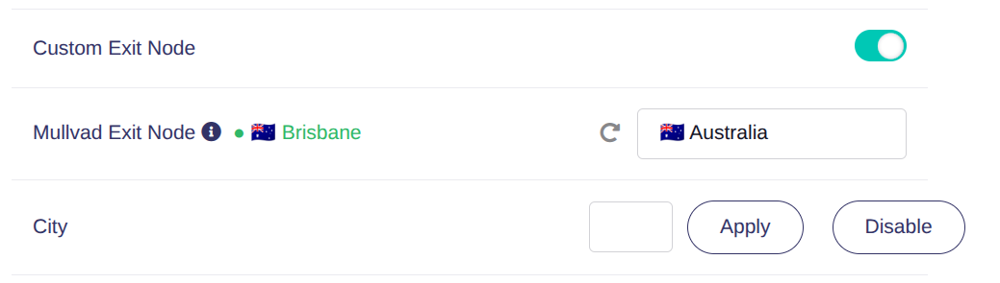

# glinet-tailscale-mullvad

Adds a **Mullvad exit-node picker** to the GL.iNet admin-UI Tailscale panel:
a country select (flag + name) and a city select in the panel's own row style,
with a green active indicator (`● 🇦🇺 Brisbane`) on the label, Apply/Disable
buttons, and an explicit "not available on this router" message when the
device has no Mullvad access — instead of silently hiding. Switching between
nodes while one is active is applied live (no restart); after a first enable
the picker polls until the node is confirmed active.

### Mullvad access is per-device — read this before filing a bug

The [Tailscale Mullvad add-on](https://tailscale.com/kb/1258/mullvad-exit-nodes)
must be enabled on the tailnet AND the router must hold one of the license's
**five device slots** (first-come, first-served). Two gotchas, both hit in the
field:

* Assignment via the tailnet policy file (`"nodeAttrs": [{"target": [...],
  "attr": ["mullvad"]}]`) and via the admin console are **mutually exclusive**.
* GL routers are usually **tagged** nodes — a user-scoped target
  (`"target": ["you@example.com"]`) never matches them, and it makes *every*
  device you own eligible, silently exhausting the 5 slots. Target the
  router's tag (e.g. `"target": ["tag:router"]`).



Companion to [glinet-tailscale-feed](https://github.com/DigitalCyberSoft/glinet-tailscale-feed)
(which restores the Tailscale panel itself). The built ipk is published through
that same feed: `tools/release.sh` stages it into the feed checkout's `gui/`
directory, and the feed's CI fans `gui/*_all.ipk` into every arch dir of the
Pages site (see its `tools/assemble_site.sh`).

## How it works

Mullvad exit nodes are ordinary tailnet peers whose `DNSName` ends in
`.mullvad.ts.net`, carrying `Location {Country, CountryCode, City, Priority}`.
There is no Mullvad binary; selection is `tailscale set --exit-node=<ip>`.
This package therefore ships no compiled code (`Architecture: all`):

| Piece | Path | Role |
|---|---|---|
| RPC handler | `/usr/lib/oui-httpd/rpc/mullvad` | `get_nodes`: full-peer `tailscale status --json`, filters Mullvad peers, groups country → city, returns one best node per city (online first, then Tailscale `Location.Priority`, then stable name order). `set_exit_node`: validates the IP against the live Mullvad peer list, persists `tailscale.settings.exit_node_ip` (+ forces `advertise_exit_node=0`, same mutual exclusion the stock handler enforces). |
| View patcher | `/usr/libexec/tailscale-mullvad/patch-view.lua` | Splices `render.js` / `block.js` into the installed view bundle at two plain-string anchors; refuses to touch a bundle where either anchor does not match exactly once. Keeps a pristine backup; `remove` restores it byte-identical. |
| UI snippets | `/usr/share/tailscale-mullvad/{render,block}.js` | Compiled-render rows (country + city `<li>`s, active indicator, Apply/Disable, unavailable/error states) and a component-options wrapper adding data/computed/methods plus embedded i18n for de/en/es/it/ja/zh-cn/zh-tw. Flags are Unicode regional indicators derived from `CountryCode` (no image assets). Only proven-present components are used (`el-select`, `el-option`, `el-tooltip`, `gl-button`), and only the `ngx.pipe` methods GL's shim actually implements (`stdout_read_all`, `wait` — there is **no** `stderr_read_all`). |

### Why patch instead of shipping the bundle?

`/www/views/gl-sdk4-ui-tailscaleview.common.js.gz` is owned by
`gl-sdk4-ui-tailscaleview`; opkg refuses to install a second package owning the
same file. So `postinst` patches in place (backup kept), `prerm` restores.
Consequence: **upgrading `gl-sdk4-ui-tailscaleview` replaces the patched
bundle**. Recovery layers, in order: the feed's `gl-sdk4-ui-tailscaleview`
(≥ rev -8) reapplies the patch from its own postinst; `restore.sh` reapplies at
next boot; manual fallback is
`lua /usr/libexec/tailscale-mullvad/patch-view.lua apply`.

### Restart semantics

* Exit node already in use → switching/clearing is a **live** pref change
  (`tailscale set`), no daemon restart, no connectivity drop.
* First-time enable → full `gl_tailscale restart` (the fwmark policy rule and
  forced LAN/WAN route advertisement only exist on the `tailscale up` path;
  see `gl_tailscale` lines 183–226 in the feed). ~50 s outage on mips devices;
  the UI warns before doing this.

### Surviving firmware upgrades

sysupgrade replaces the rootfs, wiping every opkg-installed file under `/usr`
and the patched bundle under `/www`. Two layers guard against that:

1. `/lib/upgrade/keep.d/gl-sdk4-tailscale-mullvad` lists the package's own
   files directly (sysupgrade honoring keep.d for arbitrary paths is verified
   on a GL-E750, OpenWrt 22.03.4 — see glinet-tailscale-feed commit 9ffb49e,
   which preserves the whole panel the same way), plus the pristine-bundle
   backup so `remove` keeps working after an upgrade.
2. postinst additionally stashes the payload + `restore.sh` in
   `/etc/tailscale-mullvad/` (also in keep.d and `/etc/sysupgrade.conf`) and
   hooks `restore.sh` from `/etc/rc.local`. On first boot after an upgrade it
   no-ops if everything survived; otherwise it reinstates the RPC handler and
   re-patches the firmware's view bundle. This is what handles a **stock**
   firmware upgrade that ships a *new* panel bundle: the patcher re-patches it
   and refreshes the pristine backup, or fails closed (logging to
   `/tmp/tsmullvad-restore.log`) if the new bundle's anchors don't match.

Files restored by layer 2 are functional immediately but unknown to opkg until
you reinstall the package from the feed. `opkg remove` undoes all hooks.

## Scope / verified against

* End-to-end on a **GL-XE3000 (fw 4.8, aarch64)** against a live Mullvad
  tailnet (530 nodes, 50 countries): install, render, country/city selection,
  first-enable apply (restart path), live switch, disable, active indicator.
  `get_nodes` parses the ~870KB peer JSON in ~0.4s on that hardware.
* Patch anchors verified unique in the feed's view bundle
  **git-2025.244.27716-e9a0fdd** (vendored as `test/view-reference.js`; build
  aborts if they stop matching) **and** in the stock XE3000 4.8 bundle. Other
  bundle versions: the patcher fails closed (no write) if anchors drift.
* `tailscale status --json` shape verified on **1.98.8–1.100.0**
  (`ExitNodeOption`, `Location`, `ExitNodeStatus`). `tailscale set
  --exit-node` needs ≥ 1.28. Not yet exercised: E750/mips (fw 4.3.x) and a
  real firmware upgrade through the keep.d/restore path.

## Build & test

```sh
./build.py                                  # verify (anchors + node --check) + build -> out/
tailscale status --json > /tmp/status.json  # on any Mullvad-enabled tailnet device
test/run-tests.sh /tmp/status.json          # patcher e2e + differential rpc tests
tools/release.sh                            # build + stage into ../glinet-tailscale/gui/
```

`test/run-tests.sh` needs `lua`, `node`, `python3`. It round-trips the patcher
in a fake root (apply → idempotent re-apply → restore byte-identical) and runs
the real RPC handler under stubs against the captured status JSON, diffing its
grouping against an independent Python implementation.

## Install (on the router)

Same feed as the panel itself — if glinet-tailscale-feed is already configured
(see its INSTALL.md for the `src/gz glits .../<arch>` line and why
`--force-signature` is needed), it is just:

```sh
opkg update  --force-signature
opkg install --force-signature gl-sdk4-tailscale-mullvad
```
